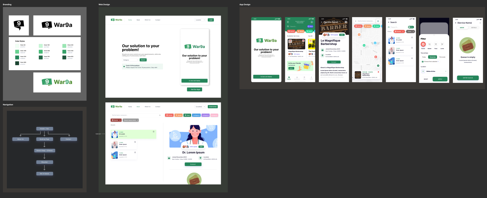
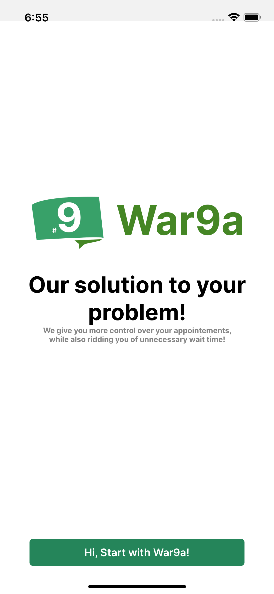
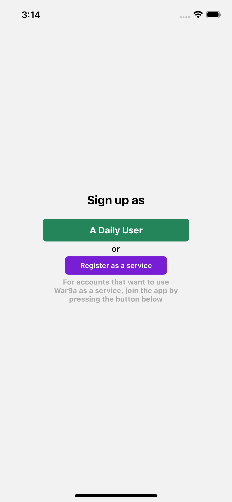
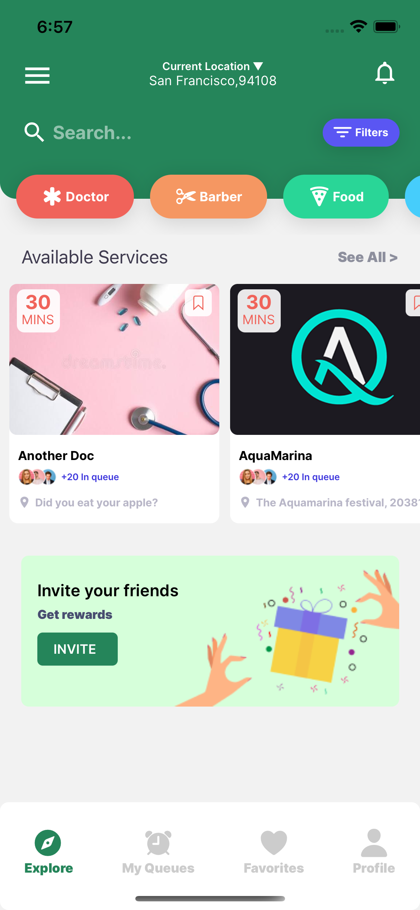
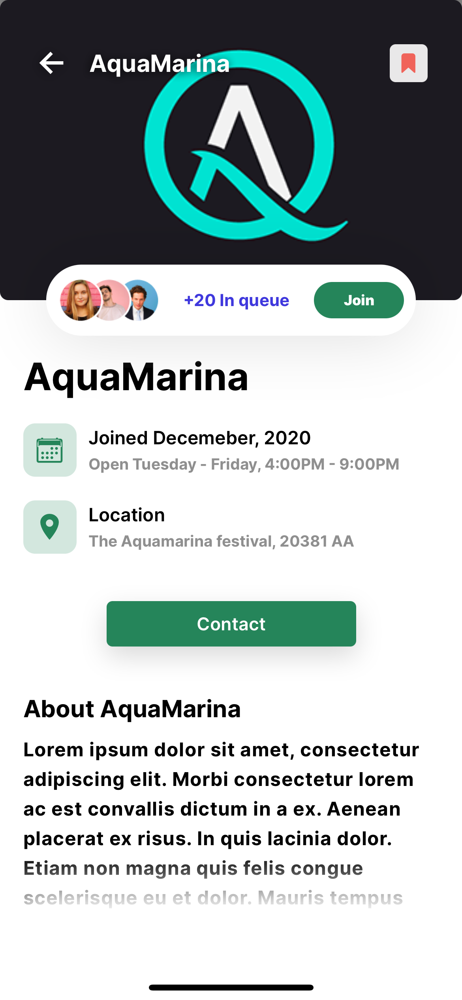
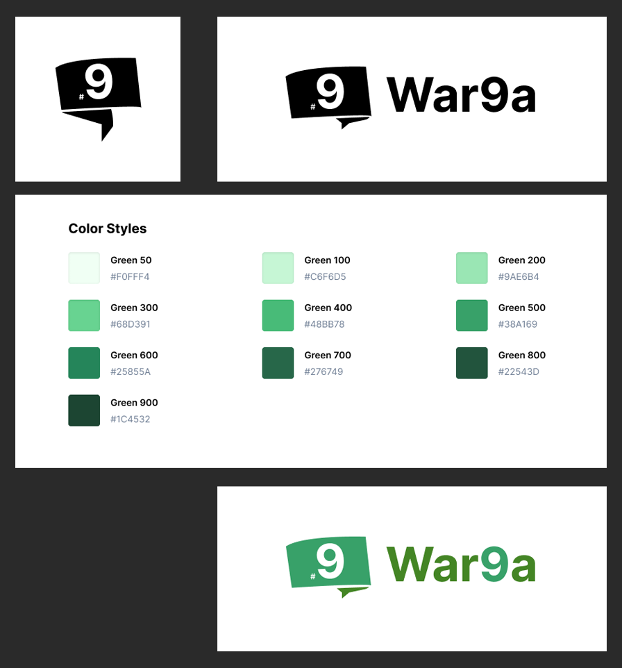
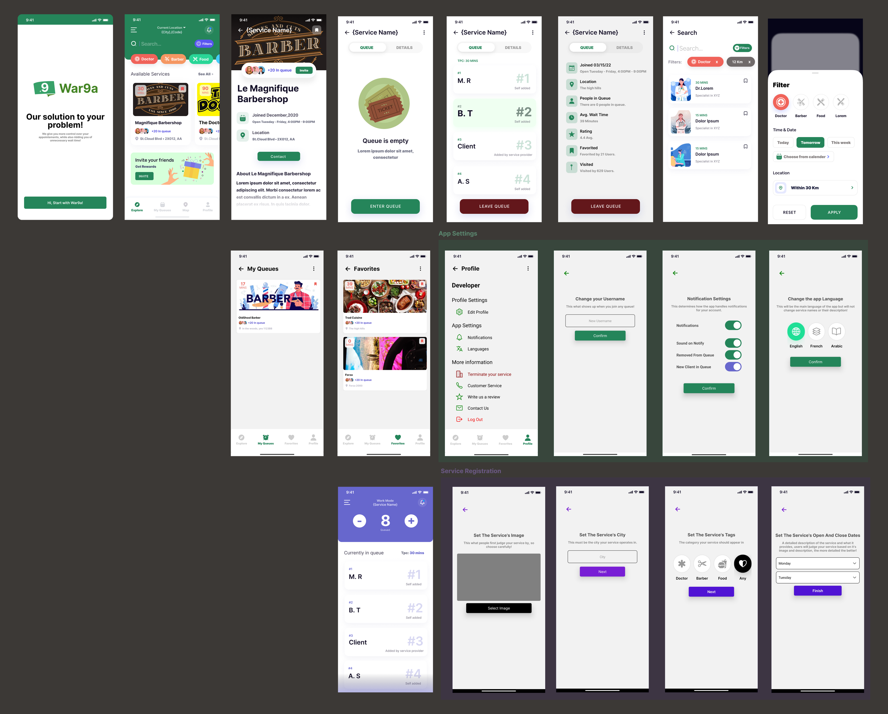
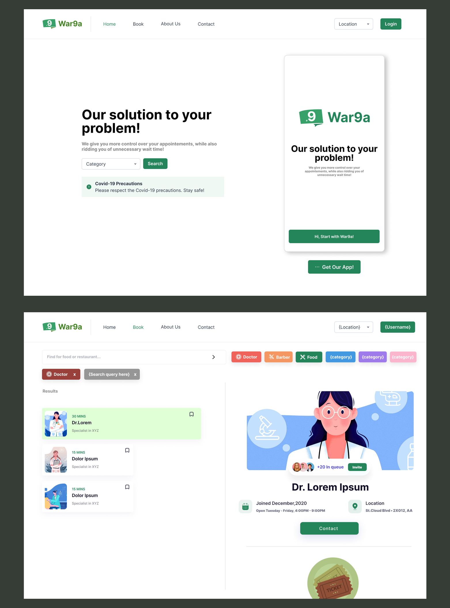

# War9a - a Smart Queuing System (Work in progress!)

<div id="top"></div>


<!-- PROJECT LOGO -->
<br />
<div align="center">
  <a href="https://github.com/Clstialdev/War9a">
    
  </a>

<h3 align="center">War9a a Queuing System</h3>

  <p align="center">
    an app and a platform where all services are able to provide an algorithmically accurate queuing experience through our queuing system, while our solution focuses mainly on queuing it also provides a reservation system as well, thus incentivising businesses and individuals to use our solution.
</p>
    <br />
    <a href="https://github.com/Clstialdev/War9a"><strong>Explore the code! »</strong></a>
    <br />
    <br />
    <a href="https://github.com/Clstialdev/War9a">View Demo</a>
    ·
    <a href="https://github.com/Clstialdev/War9a/issues">Report Bug</a>
    ·
    <a href="https://github.com/Clstialdev/War9a/issues">Request Feature</a>
  
</div>


<!-- TABLE OF CONTENTS -->
<details>
  <summary>Table of Contents</summary>
  <ol>
    <li>
      <a href="#about-the-project">About The Project</a>
      <ul>
        <li><a href="#built-with">Built With</a></li>
      </ul>
    </li>
    <li><a href="#screenshots">Screenshots</a></li>
    <li>
      <a href="#getting-started">Getting Started</a>
      <ul>
        <li><a href="#prerequisites">Prerequisites</a></li>
        <li><a href="#installation">Installation</a></li>
      </ul>
    </li>
    <li><a href="#roadmap">Roadmap</a></li>
    <li><a href="#contact">Contact</a></li>
  </ol>
</details>


<!-- ABOUT THE PROJECT -->
## About The Project



<p align="right">(<a href="#top">back to top</a>)</p>


### Built With

* [React.js](https://reactjs.org/)
* [Expo](https://expo.dev/)
* [React Native](https://reactnative.dev)
* [Firebase](https://firebase.google.com/)
* [TypeScript](https://www.typescriptlang.org/)
* [Ruby](https://www.ruby-lang.org/en/)
* [JSX]

<p align="right">(<a href="#top">back to top</a>)</p>

### Screenshots

<div style="align:center; display:flex; justify-content:center; align-items:center" align="center">
    
    
    
    
  </div>

<p align="right">(<a href="#top">back to top</a>)</p>

<!-- Design -->
## Design
<details>
  <summary>Branding</summary>
  <div style="align:center; display:flex; justify-content:center; align-items:center" align="center">
    
  </div>
</details>

<details>
  <summary>Mobile Design</summary>
  <div style="align:center; display:flex; justify-content:center; align-items:center" align="center">
    
  </div>
</details>

<details>
  <summary>Web Design</summary>
  <div style="align:center; display:flex; justify-content:center; align-items:center" align="center">
    
  </div>
</details>

</br>
</br>

<!-- GETTING STARTED -->
## Getting Started

To Get a Local copy of this project working on your machine we need:

-Node.js to be installed first.

### Prerequisites

* npm
  ```sh
  npm install -g expo-cli
  ```

### Installation

1. Open your Terminal (CMD / ZSH / POWERSHELL / BASH)

2. Clone the repo
   ```sh
   git clone https://github.com/Clstialdev/War9a
   ```
2. Change Directory to the work folder
   ```sh
   cd War9a/War9a_App
   ```
3. Install NPM packages
   ```sh
   npm install
   ```
4. Run Expo 
   ```npm
   expo start
   ```

<p align="right">(<a href="#top">back to top</a>)</p>


<!-- ROADMAP -->
## Roadmap

- [...] IOS & Android App (Almost Ready)
- [...] Web Interface (In Progress)
- [...] SMS Messaging
- [...] In App Service Chat

See the [open issues](https://github.com/Clstialdev/War9a/issues) for a full list of proposed features (and known issues).

<p align="right">(<a href="#top">back to top</a>)</p>


<!-- CONTACT -->
## Contact

Project Link: [War9a](https://github.com/Clstialdev/War9a)

<p align="right">(<a href="#top">back to top</a>)</p>
